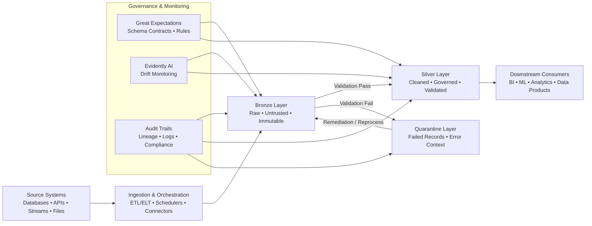
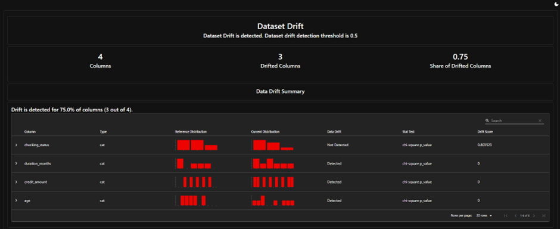
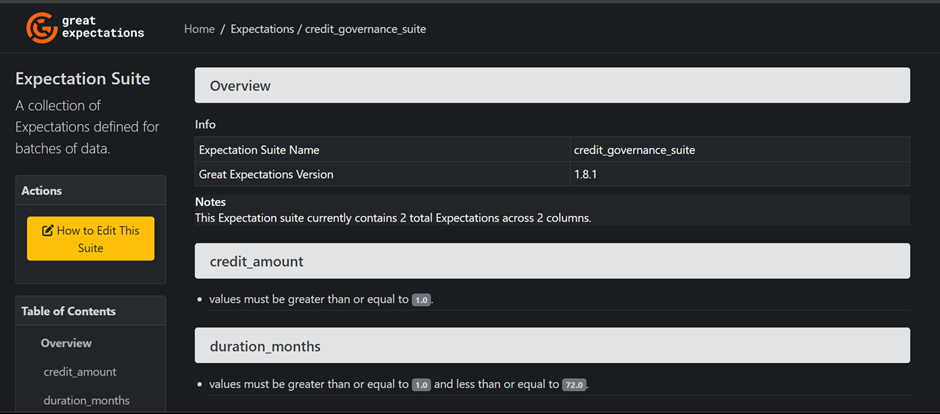

# Auditable Data Pipeline & Governance

An end-to-end data engineering and model governance pipeline built to ensure regulatory compliance, data quality, and drift detection. This system processes credit risk data, isolates anomalous transactions, and monitors data distribution over time.

## 📖 Medium Article
Read the architectural breakdown and the governance design on Medium:
- **[Building an Auditable Data Pipeline: Implementing NIST RMF and EU AI Act Controls for Responsible AI](https://medium.com/@vrrajadurai/building-an-auditable-data-pipeline-implementing-nist-rmf-and-eu-ai-act-controls-for-responsible-0dc031f62a9e)**


## 🏛️ Architecture Overview
The pipeline processes data through three distinct layers to maintain auditability and data integrity:

1. **Bronze Layer:** Ingestion of raw, untrusted data.
2. **Silver Layer:** Cleaned, governed, and validated data ready for consumption.
3. **Quarantine Layer:** Isolated records that fail governance rules.

## 🛡️ Governance Frameworks
This pipeline implements the following controls:
- **Great Expectations:** Enforces schema contracts and bounds rules.
- **Evidently AI:** Monitors continuous dataset drift.
- **Audit Trails:** Generates documentation necessary for NIST AI RMF and EU AI Act compliance.

## Auditable Data Pipeline Architecture



## Project Structure

```
auditable-data-pipeline-governance/
├── app.py                      # Main governance application
├── data_generator.py           # Generates sample credit data with intentional issues
├── data_generator_2.py         # Additional data generator
├── governance_gatekeeper.py    # Core governance validation logic
├── initialize_gx.py            # Great Expectations context initialization
├── evidently_ai.py             # Data drift detection and reporting
├── data/
│   ├── bronze/                 # Raw, unvalidated data
│   │   └── credit_data.csv
│   ├── silver/                 # Validated, governed data
│   │   ├── credit_data_governed.csv
│   │   ├── reference_data.csv
│   │   └── data_drift_report.html
│   └── quarantine/            # Failed records isolated for review
│       └── failed_records.csv
├── notebooks/                  # Jupyter notebooks for exploration
└── tests/                      # Test suite
```

## Architecture & Pipeline Layers

This project implements a production-grade multi-layer data storage **Medallion Architecture**:

- **Bronze Layer:** Contains the raw, untrusted incoming datasets (data/bronze/).
- **Silver Layer:** Contains the cleaned, governed, and quality-checked data that is safe for analysis (data/silver/).
- **Quarantine Layer:** Stores rejected or anomalous records, supporting traceability and audit trails (data/quarantine/).

### Data Flow

```
Source System → Bronze Layer → Governance Gatekeeper → Silver Layer (Valid)
                                           ↓
                                    Quarantine Layer (Invalid)
```

## Compliance & Governance Frameworks

This project aligns with major regulatory and standards frameworks for AI and data governance:

### NIST AI Risk Management Framework (AI RMF)

The project implements the following NIST AI RMF functions:

- **Measure**: Great Expectations provides quantitative metrics for data quality, completeness, and validity. Each validation run produces detailed pass/fail statistics and error rates that can be tracked over time.
  
- **Monitor**: Evidently AI enables continuous monitoring for data drift and distribution changes. The system generates automated HTML reports comparing reference baselines against current data, ensuring ongoing model performance and data integrity.

### EU AI Act Alignment

This pipeline addresses EU AI Act requirements through:

- **Data Minimization & PII Protection**: Sensitive consumer attributes and personally identifiable information (PII) are isolated in the Quarantine layer when they fail validation. Only validated, cleaned data proceeds to the Silver layer.
  
- **Auditability**: Complete audit trail of all data quality checks, validation results, and data transformations. Each record's journey from Bronze → Silver → Quarantine is traceable.
  
- **Explainability**: Governance rules are explicitly defined as Great Expectations "expectations" with clear documentation of what constitutes valid vs. invalid data.
  
- **Fairness**: Data quality checks ensure consistent treatment of records, preventing bias from incomplete or erroneous data from entering downstream models.

### Mapping to Governance Frameworks

The following table maps the project’s reporting tooling to both the NIST AI RMF functions and the EU AI Act requirements:

| Report Type | NIST AI RMF Function | EU AI Act Requirement |
|-------------|----------------------|-----------------------|
| Great Expectations | Measure: Programmatic validation of data quality and integrity. | Data Governance: Ensuring high-quality datasets through rigorous validation and error handling. |
| Evidently AI | Monitor: Ongoing oversight of model input stability and performance. | Transparency & Traceability: Maintaining a clear audit trail of how data evolved throughout the system lifecycle. |

## Technical Specifications & Validations

This section clearly outlines the testing and monitoring tools used in the pipeline:

### Great Expectations

- The `credit_governance_suite` automatically enforces constraints on core features.
- It ensures `credit_amount` values remain positive and bounded, and `duration_months` values stay within allowed business limits.
- This suite enforces those constraints as part of the governance validation step.

### Evidently AI

- Evidently AI generates a drift detection report that summarizes shifts in the data population.
- The report compares current governed data against the reference dataset to identify changes on key features.
- It tracks population shifts for:
  - `checking_status`
  - `duration_months`
  - `credit_amount`
  - `age`
- When drift is detected, the report highlights deviations from the expected reference distribution.

## 🚀 Getting Started

### Prerequisites
- Python 3.9+
- Conda or virtual environment manager
- `git`

### Installation
```bash
git clone [https://github.com/vrrgithub1/auditable-data-pipeline-governance.git](https://github.com/vrrgithub1/auditable-data-pipeline-governance.git)
cd auditable-data-pipeline-governance
pip install -r requirements.txt
```
#### Execution
- 1. Initialize data context:

```Bash
python initialize_gx.py
```
- 2. Run data generator and validation:

```Bash
python data_generator.py
```

- 3. Run the drift detection report:

```Bash
python evidently_ai.py
```

## Setup & Execution Instructions

### Prerequisites

- Python 3.9+
- Conda environment: `governance_pipeline`
- Dependencies: `pip install -r requirements.txt` (or specify evident/Great Expectations installs)

### Running the Pipeline

1. **Initialize Great Expectations**:
   ```bash
   python initialize_gx.py
   ```

2. **Generate the governed datasets and run validation checks**:
   ```bash
   python data_generator.py
   ```

3. **Generate the Evidently Data Drift Report**:
   ```bash
   python evidently_ai.py
   ```

## Components

### 1. Governance Initialization (`initialize_gx.py`)

Sets up the Great Expectations context and creates the Medallion Architecture folder structure.

### 2. Governance Gatekeeper (`governance_gatekeeper.py`)

Core validation engine that:
- Defines governance rules (expectations)
- Validates data against rules
- Routes clean data to Silver layer
- Quarantines failed records

### 3. Data Drift Detection (`evidently_ai.py`)

Monitors for data distribution changes by comparing:
- Reference dataset (baseline)
- Current dataset (new data)

Generates HTML drift reports for visualization.

### 4. Main Application (`app.py`)

Orchestrates the entire governance workflow:
1. Setup governance suite with rules
2. Create data source and assets
3. Load and validate Bronze data
4. Generate validation results

## Setup and Execution

### Prerequisites

- Python 3.9+
- Conda or virtual environment manager
- Clone the repository and navigate to the project directory.

### Installation

1. Create and activate the environment:
   ```bash
   conda create -n governance_pipeline python=3.10 -y
   conda activate governance_pipeline
   ```
2. Install the required packages:
   ```bash
   pip install -r requirements.txt
   ```

### Pipeline Execution

1. Initialize Data Context:
   ```bash
   python initialize_gx.py
   ```
2. Generate and Govern Data:
   ```bash
   python data_generator.py
   ```
3. Run Monitoring Suite:
   ```bash
   python evidently_ai.py
   ```

## Governance Rules

The system enforces the following data quality rules:

| Rule | Description | Column |
|------|-------------|--------|
| Positive Values | Credit amount must be greater than 0 | `credit_amount` |
| Valid Duration | Duration in months must be between 1 and 72 | `duration_months` |

## Data Flow

```
Bronze (Raw) → Governance Gatekeeper → Silver (Governed)
                   ↓                      ↓
              Quarantine            Validated Data
```

## Output

- **Validation Results**: Detailed pass/fail status for each record
- **Drift Report**: HTML report showing data distribution changes
- **Audit Trail**: Complete history of data quality checks

## Visual Outputs

The project includes major visual artifacts that document the governance and monitoring results:

### Evidently AI Data Drift Report



This report visually summarizes population shifts against the reference dataset and highlights drift on key features.

### Great Expectations Suite Dashboard



This dashboard displays the validation suite status and governance checks for the credit dataset.

## Future Extensions

Improvements to the pipeline, such as:

- Automating orchestration with tools like *Prefect* or *Apache Airflow*.
- Adding an automated model training stage that retrains on governed data only when drift is detected.

## 📜 License
This project is licensed under the MIT License.

Copyright (c) 2026 Venkat Rajadurai

Permission is hereby granted, free of charge, to any person obtaining a copy
of this software and associated documentation files (the "Software"), to deal
in the Software without restriction, including without limitation the rights
to use, copy, modify, merge, publish, distribute, sublicense, and/or sell
copies of the Software, and to permit persons to whom the Software is
furnished to do so, subject to the following conditions:

The above copyright notice and this permission notice shall be included in all
copies or substantial portions of the Software.

THE SOFTWARE IS PROVIDED "AS IS", WITHOUT WARRANTY OF ANY KIND, EXPRESS OR
IMPLIED, INCLUDING BUT NOT LIMITED TO THE WARRANTIES OF MERCHANTABILITY,
FITNESS FOR A PARTICULAR PURPOSE AND NONINFRINGEMENT. IN NO EVENT SHALL THE
AUTHORS OR COPYRIGHT HOLDERS BE LIABLE FOR ANY CLAIM, DAMAGES OR OTHER
LIABILITY, WHETHER IN AN ACTION OF CONTRACT, TORT OR OTHERWISE, ARISING FROM,
OUT OF OR IN CONNECTION WITH THE SOFTWARE OR THE USE OR OTHER DEALINGS IN THE
SOFTWARE.